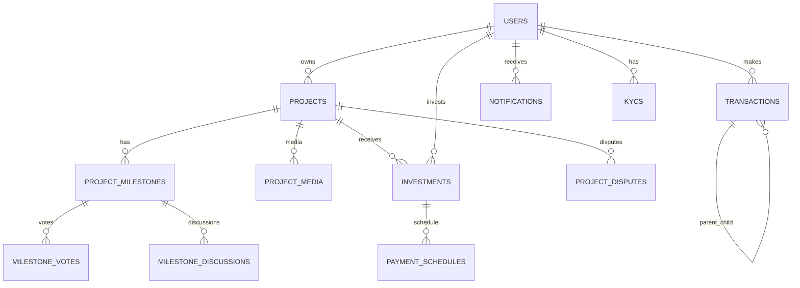

# DATABASE.md — Tổng quan thiết kế cơ sở dữ liệu

Mục đích: tài liệu tóm tắt schema chính cho nền tảng gọi vốn/đầu tư (InvestPro). Bao gồm sơ đồ ER, danh sách thực thể cốt lõi, lưu đồ dòng tiền và phần tham chiếu SQL DDL (dưới đây).

Last updated: 2026-05-10

Tóm tắt nhanh:

- Mô hình chính: Users (investor/owner/admin), Projects (cùng Milestones), Investments, Wallet/Transactions, KYC, Notifications, Disputes, Chat History.
- Tiền được giữ trong escrow theo giai đoạn (milestone). Transactions lưu parent-child để tách phí nền tảng và thanh toán tới investor/owner.

Thực thể cốt lõi (core entities):

- `users`: thông tin tài khoản, role, balance, trạng thái KYC, is_frozen.
- `projects`: metadata, mục tiêu gọi vốn, trạng thái, liên kết `owner_id`.
- `project_milestones`: milestone + evidence + trạng thái voting/admin review.
- `investments`: mối quan hệ investor ↔ project, số tiền và trạng thái.
- `transactions`: ledger cho mọi luồng tiền (deposit, invest, disbursement, refund, repayment, fee).
- `kycs`: ảnh CMND/CCCD và trạng thái xét duyệt.
- `notifications`: per-user notifications, read/unread.
- `project_disputes`: khiếu nại/đóng băng dự án.
- `chat_history`: lưu context AI per-user.

ER diagram (mermaid) — khái quát:



DBML diagram (dbdiagram.io) — khái quát entity chính:

```dbml
Project investpro {
  database_type: "MySQL"
  Note: "InvestPro crowdfunding and micro-investment schema"
}

Enum user_role {
  investor
  owner
  admin
}

Enum project_risk_level {
  low
  medium
  high
}

Enum project_status {
  pending
  funding
  active
  pending_admin_review
  completed
  overdue
  failed
}

Enum media_type {
  image
  video
}

Enum milestone_status {
  pending
  uploading_proof
  voting
  admin_review
  disbursed
  completed
  rejected
  disputed
}

Enum investment_status {
  active
  completed
  withdrawn
}

Enum schedule_status {
  unpaid
  paid
  overdue
}

Enum transaction_type {
  deposit
  withdrawal
  invest
  interest_receive
  refund
  disbursement
  repayment
  repay_interest
  repay_principal
  system_fee
  system_log
}

Enum transaction_status {
  pending
  success
  failed
}

Enum dispute_status {
  open
  resolved
  refunded
}

Enum notification_type {
  PROJECT_UPDATE
  INVESTMENT_RECEIVED
  PAYMENT_SUCCESS
  SYSTEM
}

Enum chat_role {
  user
  model
  system
}

Enum kyc_status {
  PENDING
  APPROVED
  REJECTED
}

Enum blog_status {
  draft
  published
  archived
}

Table users {
  updateProfile method
  changePassword method
  updateAvatar method
  toggleCategoryPreference method
  freezeAccount method
  canInvest method
  id bigint [pk, increment]
  email varchar(150) [not null, unique]
  password varchar(255) [not null]
  full_name varchar(100) [not null]
  role user_role [default: "investor"]
  balance decimal(15,2) [default: 0.00]
  avatar_url varchar(255)
  is_verified boolean [default: false]
  bio text
  cover_photo_url varchar(255)
  social_links json
  notification_settings json
  is_frozen boolean [default: false]
  slug varchar(150) [unique]
  address varchar(255)
  created_at timestamp
  updated_at timestamp
}

Table project_categories {
  listCategories method
  updateInfo method
  id bigint [pk, increment]
  name varchar(100) [not null]
  slug varchar(100) [not null, unique]
  description text
  icon_url varchar(255)
  created_at timestamp
}

Table projects {
  createProject method
  updateProject method
  deleteProject method
  approveProject method
  rejectProject method
  stopFunding method
  invest method
  createDispute method
  terminateProject method
  id bigint [pk, increment]
  owner_id bigint [not null]
  category_id bigint [not null]
  title varchar(255) [not null]
  slug varchar(255) [not null, unique]
  address varchar(255)
  short_description text
  content longtext
  goal_amount decimal(15,2) [not null]
  current_amount decimal(15,2) [default: 0.00]
  min_investment decimal(15,2) [not null]
  interest_rate decimal(5,2) [not null]
  commission_rate decimal(5,2)
  duration_months int [not null]
  risk_level project_risk_level [default: "medium"]
  status project_status [default: "pending"]
  start_date date
  end_date date
  is_frozen boolean [default: false]
  allow_overfunding boolean [default: false]
  total_debt decimal(15,2) [default: 0.00]
  owner_tier int [default: 1]
  created_at timestamp
}

Table project_media {
  attachToProject method
  markAsThumbnail method
  updateSortOrder method
  removeMedia method
  id int [pk, increment]
  project_id bigint [not null]
  url varchar(255) [not null]
  type media_type [default: "image"]
  is_thumbnail boolean [default: false]
  sort_order int [default: 0]
}

Table project_milestones {
  createOrUpdateMilestones method
  submitProof method
  startVoting method
  finalizeMilestone method
  rejectMilestone method
  disburseMilestoneFunds method
  resetVote method
  id int [pk, increment]
  project_id bigint [not null]
  title varchar(255) [not null]
  content text
  percentage int [not null]
  stage int [not null]
  status milestone_status [default: "pending"]
  evidence_urls text
  disbursement_date timestamp
  voting_ends_at timestamp
  rejection_reason text
  interval_days int [default: 0]
  next_disbursement_date timestamp
  created_at timestamp
}

Table milestone_discussions {
  getMilestoneDiscussions method
  adminMilestoneFeedback method
  ownerMilestoneResponse method
  postMessage method
  id int [pk, increment]
  milestone_id int [not null]
  sender_id bigint [not null]
  content text [not null]
  created_at timestamp
}

Table milestone_votes {
  castVote method
  getMilestoneVotes method
  calculateApproveWeight method
  closeVotingWindow method
  id int [pk, increment]
  milestone_id int [not null]
  user_id bigint [not null]
  is_approve boolean [not null]
  comment text
  investor_capital decimal(15,2) [default: 0.00]
  created_at timestamp
}

Table milestone_vote_snapshots {
  captureSnapshot method
  getInvestorWeight method
  getSnapshotResult method
  id bigint [pk, increment]
  milestone_id int [not null]
  snapshot_at timestamp
  total_raised decimal(15,2) [default: 0.00]
  snapshot_json json
  created_at timestamp
}

Table investments {
  invest method
  getMyInvestments method
  getAnalytics method
  getPublicInvestedProjects method
  handleProjectTimeout method
  id bigint [pk, increment]
  user_id bigint [not null]
  project_id bigint [not null]
  amount decimal(15,2) [not null]
  status investment_status [default: "active"]
  invested_at timestamp
}

Table payment_schedules {
  createSchedules method
  getOwnerSchedules method
  markPaid method
  markOverdue method
  calculateDueAmount method
  id int [pk, increment]
  investment_id bigint [not null]
  due_date date [not null]
  amount decimal(15,2) [not null]
  status schedule_status [default: "unpaid"]
  paid_at timestamp
}

Table transactions {
  getMyTransactions method
  createDeposit method
  createWithdrawRequest method
  approveWithdraw method
  rejectWithdraw method
  createChildTransaction method
  markSuccess method
  markFailed method
  id bigint [pk, increment]
  user_id bigint [not null]
  amount decimal(15,2) [not null]
  type transaction_type [not null]
  status transaction_status [default: "success"]
  description varchar(255)
  reference_id int
  parent_transaction_id bigint
  bank_name varchar(100)
  account_number varchar(50)
  created_at timestamp
}

Table project_disputes {
  createDispute method
  getFrozenProjects method
  resolveDisputes method
  refundDispute method
  dismissDispute method
  id int [pk, increment]
  project_id bigint [not null]
  user_id bigint [not null]
  reason text [not null]
  evidence_url text
  status dispute_status [default: "open"]
  created_at timestamp
}

Table user_favorite_categories {
  toggleFavoriteCategory method
  listFavoriteCategories method
  user_id bigint [not null]
  category_id bigint [not null]

  indexes {
    (user_id, category_id) [pk]
  }
}

Table user_blacklist_categories {
  toggleBlacklistCategory method
  listBlacklistCategories method
  user_id bigint [not null]
  category_id bigint [not null]

  indexes {
    (user_id, category_id) [pk]
  }
}

Table notifications {
  createSpecialNotification method
  createBatchNotifications method
  getUserNotifications method
  markAsRead method
  markAllAsRead method
  getUnreadCount method
  id int [pk, increment]
  user_id bigint [not null]
  message text [not null]
  type notification_type [default: "SYSTEM"]
  is_read boolean [default: false]
  created_at timestamp
}

Table chat_history {
  chat method
  getHistory method
  clearHistory method
  generateGeminiReply method
  buildUserFinancialContext method
  id int [pk, increment]
  user_id bigint [not null]
  role chat_role [not null]
  message text [not null]
  project_context json
  created_at timestamp

  indexes {
    (user_id, created_at) [name: "idx_chat_history_user_created_at"]
  }
}

Table user_media {
  saveMediaRecord method
  getUserMedia method
  deleteUserMedia method
  uploadImage method
  deleteImage method
  id int [pk, increment]
  user_id bigint [not null]
  url varchar(1024) [not null]
  public_id varchar(255) [not null]
  file_name varchar(255)
  file_size int
  created_at timestamp
}

Table kycs {
  submitKyc method
  getKycStatus method
  getPendingKycs method
  approveKyc method
  rejectKyc method
  getKycImage method
  id bigint [pk, increment]
  user_id bigint [not null]
  id_card_number varchar(50) [not null]
  front_image_url varchar(255) [not null]
  back_image_url varchar(255) [not null]
  status kyc_status [default: "PENDING"]
  rejection_reason text
  created_at timestamp
  updated_at timestamp
}

Table blogs {
  getPublishedBlogs method
  getPublishedBlogBySlug method
  getAdminBlogs method
  createBlog method
  updateBlog method
  deleteBlog method
  publish method
  archive method
  id bigint [pk, increment]
  author_id bigint
  title varchar(255) [not null]
  slug varchar(255) [not null, unique]
  summary text
  content longtext
  status blog_status [default: "published"]
  featured_image varchar(255)
  tags json
  published_at timestamp
  created_at timestamp
  updated_at timestamp
}

Table project_comments {
  getProjectComments method
  createProjectComment method
  replyComment method
  hideComment method
  showComment method
  id bigint [pk, increment]
  project_id bigint [not null]
  user_id bigint [not null]
  content text [not null]
  parent_comment_id bigint
  is_hidden boolean [default: false]
  created_at timestamp
}

Ref: projects.owner_id > users.id [delete: cascade]
Ref: projects.category_id > project_categories.id
Ref: project_media.project_id > projects.id [delete: cascade]
Ref: project_milestones.project_id > projects.id [delete: cascade]
Ref: milestone_discussions.milestone_id > project_milestones.id [delete: cascade]
Ref: milestone_discussions.sender_id > users.id [delete: cascade]
Ref: milestone_votes.milestone_id > project_milestones.id [delete: cascade]
Ref: milestone_votes.user_id > users.id [delete: cascade]
Ref: milestone_vote_snapshots.milestone_id > project_milestones.id [delete: cascade]
Ref: investments.user_id > users.id [delete: cascade]
Ref: investments.project_id > projects.id [delete: cascade]
Ref: payment_schedules.investment_id > investments.id [delete: cascade]
Ref: transactions.user_id > users.id [delete: cascade]
Ref: transactions.parent_transaction_id > transactions.id [delete: set null]
Ref: project_disputes.project_id > projects.id [delete: cascade]
Ref: project_disputes.user_id > users.id [delete: cascade]
Ref: user_favorite_categories.user_id > users.id [delete: cascade]
Ref: user_favorite_categories.category_id > project_categories.id [delete: cascade]
Ref: user_blacklist_categories.user_id > users.id [delete: cascade]
Ref: user_blacklist_categories.category_id > project_categories.id [delete: cascade]
Ref: notifications.user_id > users.id [delete: cascade]
Ref: chat_history.user_id > users.id [delete: cascade]
Ref: user_media.user_id > users.id [delete: cascade]
Ref: kycs.user_id > users.id [delete: cascade]
Ref: blogs.author_id > users.id [delete: set null]
Ref: project_comments.project_id > projects.id [delete: cascade]
Ref: project_comments.user_id > users.id [delete: cascade]
Ref: project_comments.parent_comment_id > project_comments.id [delete: set null]
```

Mô hình quan hệ — dạng lược đồ quan hệ:

```text
users(
  id PK,
  email UNIQUE,
  password,
  full_name,
  role,
  balance,
  avatar_url,
  is_verified,
  bio,
  cover_photo_url,
  social_links,
  notification_settings,
  is_frozen,
  slug UNIQUE,
  address,
  created_at,
  updated_at
)

project_categories(
  id PK,
  name,
  slug UNIQUE,
  description,
  icon_url,
  created_at
)

projects(
  id PK,
  owner_id FK -> users.id,
  category_id FK -> project_categories.id,
  title,
  slug UNIQUE,
  address,
  short_description,
  content,
  goal_amount,
  current_amount,
  min_investment,
  interest_rate,
  commission_rate,
  duration_months,
  risk_level,
  status,
  start_date,
  end_date,
  is_frozen,
  allow_overfunding,
  total_debt,
  owner_tier,
  created_at
)

project_media(
  id PK,
  project_id FK -> projects.id,
  url,
  type,
  is_thumbnail,
  sort_order
)

project_milestones(
  id PK,
  project_id FK -> projects.id,
  title,
  content,
  percentage,
  stage,
  status,
  evidence_urls,
  disbursement_date,
  voting_ends_at,
  rejection_reason,
  interval_days,
  next_disbursement_date,
  created_at
)

milestone_discussions(
  id PK,
  milestone_id FK -> project_milestones.id,
  sender_id FK -> users.id,
  content,
  created_at
)

milestone_votes(
  id PK,
  milestone_id FK -> project_milestones.id,
  user_id FK -> users.id,
  is_approve,
  comment,
  investor_capital,
  created_at
)

milestone_vote_snapshots(
  id PK,
  milestone_id FK -> project_milestones.id,
  snapshot_at,
  total_raised,
  snapshot_json,
  created_at
)

investments(
  id PK,
  user_id FK -> users.id,
  project_id FK -> projects.id,
  amount,
  status,
  invested_at
)

payment_schedules(
  id PK,
  investment_id FK -> investments.id,
  due_date,
  amount,
  status,
  paid_at
)

transactions(
  id PK,
  user_id FK -> users.id,
  amount,
  type,
  status,
  description,
  reference_id,
  parent_transaction_id FK -> transactions.id,
  bank_name,
  account_number,
  created_at
)

project_disputes(
  id PK,
  project_id FK -> projects.id,
  user_id FK -> users.id,
  reason,
  evidence_url,
  status,
  created_at
)

user_favorite_categories(
  user_id PK, FK -> users.id,
  category_id PK, FK -> project_categories.id
)

user_blacklist_categories(
  user_id PK, FK -> users.id,
  category_id PK, FK -> project_categories.id
)

notifications(
  id PK,
  user_id FK -> users.id,
  message,
  type,
  is_read,
  created_at
)

chat_history(
  id PK,
  user_id FK -> users.id,
  role,
  message,
  project_context,
  created_at
)

user_media(
  id PK,
  user_id FK -> users.id,
  url,
  public_id,
  file_name,
  file_size,
  created_at
)

kycs(
  id PK,
  user_id FK -> users.id,
  id_card_number,
  front_image_url,
  back_image_url,
  status,
  rejection_reason,
  created_at,
  updated_at
)

blogs(
  id PK,
  author_id FK -> users.id,
  title,
  slug UNIQUE,
  summary,
  content,
  status,
  featured_image,
  tags,
  published_at,
  created_at,
  updated_at
)

project_comments(
  id PK,
  project_id FK -> projects.id,
  user_id FK -> users.id,
  content,
  parent_comment_id FK -> project_comments.id,
  is_hidden,
  created_at
)
```

Mô hình quan hệ — tóm tắt liên kết:

```text
users 1--N projects
project_categories 1--N projects
projects 1--N project_media
projects 1--N project_milestones
project_milestones 1--N milestone_discussions
project_milestones 1--N milestone_votes
project_milestones 1--N milestone_vote_snapshots

users 1--N investments
projects 1--N investments
investments 1--N payment_schedules

users 1--N transactions
transactions 1--N transactions

projects 1--N project_disputes
users 1--N project_disputes
projects 1--N project_comments
users 1--N project_comments
project_comments 1--N project_comments

users 1--N kycs
users 1--N notifications
users 1--N chat_history
users 1--N user_media
users 1--N blogs

users N--N project_categories through user_favorite_categories
users N--N project_categories through user_blacklist_categories
```

Mô hình vật lý — danh sách bảng và cột:

### `users`

| Column | Type | Null | Extra | Link to |
| --- | --- | --- | --- | --- |
| id | BIGINT UNSIGNED | No | PK, AUTO_INCREMENT | - |
| email | VARCHAR(150) | No | UNIQUE | - |
| password | VARCHAR(255) | No | - | - |
| full_name | VARCHAR(100) | No | - | - |
| role | ENUM('investor','owner','admin') | No | DEFAULT 'investor' | - |
| balance | DECIMAL(15,2) | No | DEFAULT 0.00 | - |
| avatar_url | VARCHAR(255) | Yes | - | - |
| is_verified | TINYINT(1) | No | DEFAULT 0 | - |
| bio | TEXT | Yes | - | - |
| cover_photo_url | VARCHAR(255) | Yes | - | - |
| social_links | JSON | Yes | - | - |
| notification_settings | JSON | Yes | - | - |
| is_frozen | TINYINT(1) | No | DEFAULT 0 | - |
| slug | VARCHAR(150) | Yes | UNIQUE | - |
| address | VARCHAR(255) | Yes | - | - |
| created_at | TIMESTAMP | No | DEFAULT CURRENT_TIMESTAMP | - |
| updated_at | TIMESTAMP | No | ON UPDATE CURRENT_TIMESTAMP | - |

### `project_categories`

| Column | Type | Null | Extra | Link to |
| --- | --- | --- | --- | --- |
| id | BIGINT UNSIGNED | No | PK, AUTO_INCREMENT | - |
| name | VARCHAR(100) | No | - | - |
| slug | VARCHAR(100) | No | UNIQUE | - |
| description | TEXT | Yes | - | - |
| icon_url | VARCHAR(255) | Yes | - | - |
| created_at | TIMESTAMP | No | DEFAULT CURRENT_TIMESTAMP | - |

### `projects`

| Column | Type | Null | Extra | Link to |
| --- | --- | --- | --- | --- |
| id | BIGINT UNSIGNED | No | PK, AUTO_INCREMENT | - |
| owner_id | BIGINT UNSIGNED | No | FK, INDEX | users.id |
| category_id | BIGINT UNSIGNED | No | FK, INDEX | project_categories.id |
| title | VARCHAR(255) | No | - | - |
| slug | VARCHAR(255) | No | UNIQUE, INDEX | - |
| address | VARCHAR(255) | Yes | - | - |
| short_description | TEXT | Yes | - | - |
| content | LONGTEXT | Yes | - | - |
| goal_amount | DECIMAL(15,2) | No | - | - |
| current_amount | DECIMAL(15,2) | No | DEFAULT 0.00 | - |
| min_investment | DECIMAL(15,2) | No | - | - |
| interest_rate | DECIMAL(5,2) | No | - | - |
| commission_rate | DECIMAL(5,2) | Yes | - | - |
| duration_months | INT | No | - | - |
| risk_level | ENUM('low','medium','high') | No | DEFAULT 'medium' | - |
| status | ENUM('pending','funding','active','pending_admin_review','completed','overdue','failed') | No | DEFAULT 'pending', INDEX | - |
| start_date | DATE | Yes | - | - |
| end_date | DATE | Yes | - | - |
| is_frozen | TINYINT(1) | No | DEFAULT 0, INDEX | - |
| allow_overfunding | TINYINT(1) | No | DEFAULT 0 | - |
| total_debt | DECIMAL(15,2) | No | DEFAULT 0.00 | - |
| owner_tier | INT | No | DEFAULT 1 | - |
| created_at | TIMESTAMP | No | DEFAULT CURRENT_TIMESTAMP | - |

### `project_media`

| Column | Type | Null | Extra | Link to |
| --- | --- | --- | --- | --- |
| id | INT UNSIGNED | No | PK, AUTO_INCREMENT | - |
| project_id | BIGINT UNSIGNED | No | FK | projects.id |
| url | VARCHAR(255) | No | - | - |
| type | ENUM('image','video') | No | DEFAULT 'image' | - |
| is_thumbnail | TINYINT(1) | No | DEFAULT 0 | - |
| sort_order | INT | No | DEFAULT 0 | - |

### `project_milestones`

| Column | Type | Null | Extra | Link to |
| --- | --- | --- | --- | --- |
| id | INT UNSIGNED | No | PK, AUTO_INCREMENT | - |
| project_id | BIGINT UNSIGNED | No | FK | projects.id |
| title | VARCHAR(255) | No | - | - |
| content | TEXT | Yes | - | - |
| percentage | INT | No | - | - |
| stage | INT | No | - | - |
| status | ENUM('pending','uploading_proof','voting','admin_review','disbursed','completed','rejected','disputed') | No | DEFAULT 'pending' | - |
| evidence_urls | TEXT | Yes | - | - |
| disbursement_date | TIMESTAMP | Yes | - | - |
| voting_ends_at | TIMESTAMP | Yes | - | - |
| rejection_reason | TEXT | Yes | - | - |
| interval_days | INT | No | DEFAULT 0 | - |
| next_disbursement_date | TIMESTAMP | Yes | - | - |
| created_at | TIMESTAMP | No | DEFAULT CURRENT_TIMESTAMP | - |

### `milestone_discussions`

| Column | Type | Null | Extra | Link to |
| --- | --- | --- | --- | --- |
| id | INT UNSIGNED | No | PK, AUTO_INCREMENT | - |
| milestone_id | INT UNSIGNED | No | FK | project_milestones.id |
| sender_id | BIGINT UNSIGNED | No | FK | users.id |
| content | TEXT | No | - | - |
| created_at | TIMESTAMP | No | DEFAULT CURRENT_TIMESTAMP | - |

### `milestone_votes`

| Column | Type | Null | Extra | Link to |
| --- | --- | --- | --- | --- |
| id | INT UNSIGNED | No | PK, AUTO_INCREMENT | - |
| milestone_id | INT UNSIGNED | No | FK | project_milestones.id |
| user_id | BIGINT UNSIGNED | No | FK | users.id |
| is_approve | TINYINT(1) | No | - | - |
| comment | TEXT | Yes | - | - |
| investor_capital | DECIMAL(15,2) | No | DEFAULT 0.00 | - |
| created_at | TIMESTAMP | No | DEFAULT CURRENT_TIMESTAMP | - |

### `milestone_vote_snapshots`

| Column | Type | Null | Extra | Link to |
| --- | --- | --- | --- | --- |
| id | BIGINT UNSIGNED | No | PK, AUTO_INCREMENT | - |
| milestone_id | BIGINT UNSIGNED | No | FK | project_milestones.id |
| snapshot_at | TIMESTAMP | No | DEFAULT CURRENT_TIMESTAMP | - |
| total_raised | DECIMAL(15,2) | No | DEFAULT 0.00 | - |
| snapshot_json | JSON | Yes | - | - |
| created_at | TIMESTAMP | No | DEFAULT CURRENT_TIMESTAMP | - |

### `investments`

| Column | Type | Null | Extra | Link to |
| --- | --- | --- | --- | --- |
| id | BIGINT UNSIGNED | No | PK, AUTO_INCREMENT | - |
| user_id | BIGINT UNSIGNED | No | FK, INDEX | users.id |
| project_id | BIGINT UNSIGNED | No | FK, INDEX | projects.id |
| amount | DECIMAL(15,2) | No | - | - |
| status | ENUM('active','completed','withdrawn') | No | DEFAULT 'active' | - |
| invested_at | TIMESTAMP | No | DEFAULT CURRENT_TIMESTAMP | - |

### `payment_schedules`

| Column | Type | Null | Extra | Link to |
| --- | --- | --- | --- | --- |
| id | INT UNSIGNED | No | PK, AUTO_INCREMENT | - |
| investment_id | BIGINT UNSIGNED | No | FK | investments.id |
| due_date | DATE | No | - | - |
| amount | DECIMAL(15,2) | No | - | - |
| status | ENUM('unpaid','paid','overdue') | No | DEFAULT 'unpaid' | - |
| paid_at | TIMESTAMP | Yes | - | - |

### `transactions`

| Column | Type | Null | Extra | Link to |
| --- | --- | --- | --- | --- |
| id | BIGINT UNSIGNED | No | PK, AUTO_INCREMENT | - |
| user_id | BIGINT UNSIGNED | No | FK, INDEX | users.id |
| amount | DECIMAL(15,2) | No | - | - |
| type | ENUM('deposit','withdrawal','invest','interest_receive','refund','disbursement','repayment','repay_interest','repay_principal','system_fee','system_log') | No | - | - |
| status | ENUM('pending','success','failed') | No | DEFAULT 'success' | - |
| description | VARCHAR(255) | Yes | - | - |
| reference_id | INT | Yes | - | - |
| parent_transaction_id | BIGINT UNSIGNED | Yes | FK | transactions.id |
| bank_name | VARCHAR(100) | Yes | - | - |
| account_number | VARCHAR(50) | Yes | - | - |
| created_at | TIMESTAMP | No | DEFAULT CURRENT_TIMESTAMP, INDEX | - |

### `project_disputes`

| Column | Type | Null | Extra | Link to |
| --- | --- | --- | --- | --- |
| id | INT UNSIGNED | No | PK, AUTO_INCREMENT | - |
| project_id | BIGINT UNSIGNED | No | FK, INDEX | projects.id |
| user_id | BIGINT UNSIGNED | No | FK | users.id |
| reason | TEXT | No | - | - |
| evidence_url | TEXT | Yes | - | - |
| status | ENUM('open','resolved','refunded') | No | DEFAULT 'open', INDEX | - |
| created_at | TIMESTAMP | No | DEFAULT CURRENT_TIMESTAMP | - |

### `user_favorite_categories`

| Column | Type | Null | Extra | Link to |
| --- | --- | --- | --- | --- |
| user_id | BIGINT UNSIGNED | No | PK, FK | users.id |
| category_id | BIGINT UNSIGNED | No | PK, FK | project_categories.id |

### `user_blacklist_categories`

| Column | Type | Null | Extra | Link to |
| --- | --- | --- | --- | --- |
| user_id | BIGINT UNSIGNED | No | PK, FK | users.id |
| category_id | BIGINT UNSIGNED | No | PK, FK | project_categories.id |

### `notifications`

| Column | Type | Null | Extra | Link to |
| --- | --- | --- | --- | --- |
| id | INT UNSIGNED | No | PK, AUTO_INCREMENT | - |
| user_id | BIGINT UNSIGNED | No | FK | users.id |
| message | TEXT | No | - | - |
| type | ENUM('PROJECT_UPDATE','INVESTMENT_RECEIVED','PAYMENT_SUCCESS','SYSTEM') | No | DEFAULT 'SYSTEM' | - |
| is_read | TINYINT(1) | No | DEFAULT 0 | - |
| created_at | TIMESTAMP | No | DEFAULT CURRENT_TIMESTAMP | - |

### `chat_history`

| Column | Type | Null | Extra | Link to |
| --- | --- | --- | --- | --- |
| id | INT UNSIGNED | No | PK, AUTO_INCREMENT | - |
| user_id | BIGINT UNSIGNED | No | FK, INDEX | users.id |
| role | ENUM('user','model','system') | No | - | - |
| message | TEXT | No | - | - |
| project_context | JSON | Yes | - | - |
| created_at | TIMESTAMP | No | DEFAULT CURRENT_TIMESTAMP, INDEX | - |

### `user_media`

| Column | Type | Null | Extra | Link to |
| --- | --- | --- | --- | --- |
| id | INT UNSIGNED | No | PK, AUTO_INCREMENT | - |
| user_id | BIGINT UNSIGNED | No | FK | users.id |
| url | VARCHAR(1024) | No | - | - |
| public_id | VARCHAR(255) | No | - | - |
| file_name | VARCHAR(255) | Yes | - | - |
| file_size | INT | Yes | - | - |
| created_at | TIMESTAMP | No | DEFAULT CURRENT_TIMESTAMP | - |

### `kycs`

| Column | Type | Null | Extra | Link to |
| --- | --- | --- | --- | --- |
| id | BIGINT UNSIGNED | No | PK, AUTO_INCREMENT | - |
| user_id | BIGINT UNSIGNED | No | FK | users.id |
| id_card_number | VARCHAR(50) | No | - | - |
| front_image_url | VARCHAR(255) | No | - | - |
| back_image_url | VARCHAR(255) | No | - | - |
| status | ENUM('PENDING','APPROVED','REJECTED') | No | DEFAULT 'PENDING' | - |
| rejection_reason | TEXT | Yes | - | - |
| created_at | TIMESTAMP | No | DEFAULT CURRENT_TIMESTAMP | - |
| updated_at | TIMESTAMP | No | ON UPDATE CURRENT_TIMESTAMP | - |

### `blogs`

| Column | Type | Null | Extra | Link to |
| --- | --- | --- | --- | --- |
| id | BIGINT UNSIGNED | No | PK, AUTO_INCREMENT | - |
| author_id | BIGINT UNSIGNED | Yes | FK | users.id |
| title | VARCHAR(255) | No | - | - |
| slug | VARCHAR(255) | No | UNIQUE | - |
| summary | TEXT | Yes | - | - |
| content | LONGTEXT | Yes | - | - |
| status | ENUM('draft','published','archived') | No | DEFAULT 'published' | - |
| featured_image | VARCHAR(255) | Yes | - | - |
| tags | JSON | Yes | - | - |
| published_at | TIMESTAMP | Yes | - | - |
| created_at | TIMESTAMP | No | DEFAULT CURRENT_TIMESTAMP | - |
| updated_at | TIMESTAMP | No | ON UPDATE CURRENT_TIMESTAMP | - |

### `project_comments`

| Column | Type | Null | Extra | Link to |
| --- | --- | --- | --- | --- |
| id | BIGINT UNSIGNED | No | PK, AUTO_INCREMENT | - |
| project_id | BIGINT UNSIGNED | No | FK | projects.id |
| user_id | BIGINT UNSIGNED | No | FK | users.id |
| content | TEXT | No | - | - |
| parent_comment_id | BIGINT UNSIGNED | Yes | FK | project_comments.id |
| is_hidden | TINYINT(1) | No | DEFAULT 0 | - |
| created_at | TIMESTAMP | No | DEFAULT CURRENT_TIMESTAMP | - |

Ghi chú kiến trúc & vận hành:

- Escrow/milestone: tiền investor được ghi nhận trong ledger (`transactions`) và chỉ disburse theo milestone khi thỏa điều kiện (admin review hoặc capital-weighted vote).
- KYC & AccountStatusGuard: nhiều endpoint yêu cầu KYC `APPROVED` và `is_frozen = false`.
- Audit: mọi thay đổi tiền tệ cần tạo transaction record; giữ `parent_transaction_id` để truy vết split (ví dụ platform fee).
- Index cần thiết: users(email), users(slug), projects(slug), projects(owner_id), investments(user_id, project_id), transactions(user_id, created_at).

Phần tham chiếu SQL DDL (bắt đầu ngay sau đây) — trích xuất từ TypeORM entities.

CREATE TABLE users (
id BIGINT UNSIGNED AUTO_INCREMENT PRIMARY KEY,
email VARCHAR(150) NOT NULL UNIQUE,
password VARCHAR(255) NOT NULL,
full_name VARCHAR(100) NOT NULL,
role ENUM('investor', 'owner', 'admin') DEFAULT 'investor',
balance DECIMAL(15, 2) DEFAULT 0.00,
avatar_url VARCHAR(255) NULL,
is_verified TINYINT(1) DEFAULT 0,
bio TEXT NULL,
cover_photo_url VARCHAR(255) NULL,
social_links JSON NULL,
notification_settings JSON NULL,
is_frozen TINYINT(1) DEFAULT 0,
slug VARCHAR(150) UNIQUE NULL,
address VARCHAR(255) NULL,
created_at TIMESTAMP DEFAULT CURRENT_TIMESTAMP,
updated_at TIMESTAMP DEFAULT CURRENT_TIMESTAMP ON UPDATE CURRENT_TIMESTAMP
);

CREATE TABLE project_categories (
id BIGINT UNSIGNED AUTO_INCREMENT PRIMARY KEY,
name VARCHAR(100) NOT NULL,
slug VARCHAR(100) NOT NULL UNIQUE,
description TEXT NULL,
icon_url VARCHAR(255) NULL,
created_at TIMESTAMP DEFAULT CURRENT_TIMESTAMP
);

CREATE TABLE projects (
id BIGINT UNSIGNED AUTO_INCREMENT PRIMARY KEY,
owner_id BIGINT UNSIGNED NOT NULL,
category_id BIGINT UNSIGNED NOT NULL,
title VARCHAR(255) NOT NULL,
slug VARCHAR(255) NOT NULL UNIQUE,
address VARCHAR(255) NULL,
short_description TEXT NULL,
content LONGTEXT NULL,
goal_amount DECIMAL(15, 2) NOT NULL,
current_amount DECIMAL(15, 2) DEFAULT 0.00,
min_investment DECIMAL(15, 2) NOT NULL,
interest_rate DECIMAL(5, 2) NOT NULL,
commission_rate DECIMAL(5, 2) NULL,
duration_months INT NOT NULL,
risk_level ENUM('low', 'medium', 'high') DEFAULT 'medium',
status ENUM('pending', 'funding', 'active', 'pending_admin_review', 'completed', 'overdue', 'failed') DEFAULT 'pending',
start_date DATE NULL,
end_date DATE NULL,
is_frozen TINYINT(1) DEFAULT 0,
allow_overfunding TINYINT(1) DEFAULT 0,
total_debt DECIMAL(15, 2) DEFAULT 0.00,
owner_tier INT DEFAULT 1,
created_at TIMESTAMP DEFAULT CURRENT_TIMESTAMP,
FOREIGN KEY (owner_id) REFERENCES users(id) ON DELETE CASCADE,
FOREIGN KEY (category_id) REFERENCES project_categories(id)
);

CREATE TABLE project_media (
id INT UNSIGNED AUTO_INCREMENT PRIMARY KEY,
project_id BIGINT UNSIGNED NOT NULL,
url VARCHAR(255) NOT NULL,
type ENUM('image', 'video') DEFAULT 'image',
is_thumbnail TINYINT(1) DEFAULT 0,
sort_order INT DEFAULT 0,
FOREIGN KEY (project_id) REFERENCES projects(id) ON DELETE CASCADE
);

CREATE TABLE project_milestones (
id INT UNSIGNED AUTO_INCREMENT PRIMARY KEY,
project_id BIGINT UNSIGNED NOT NULL,
title VARCHAR(255) NOT NULL,
content TEXT NULL,
percentage INT NOT NULL,
stage INT NOT NULL,
status ENUM(
'pending',
'uploading_proof',
'voting',
'admin_review',
'disbursed',
'completed',
'rejected',
'disputed'
) DEFAULT 'pending',
evidence_urls TEXT NULL,
disbursement_date TIMESTAMP NULL,
voting_ends_at TIMESTAMP NULL,
rejection_reason TEXT NULL,
interval_days INT DEFAULT 0,
next_disbursement_date TIMESTAMP NULL,
created_at TIMESTAMP DEFAULT CURRENT_TIMESTAMP,
FOREIGN KEY (project_id) REFERENCES projects(id) ON DELETE CASCADE
);

CREATE TABLE milestone_discussions (
id INT UNSIGNED AUTO_INCREMENT PRIMARY KEY,
milestone_id INT UNSIGNED NOT NULL,
sender_id BIGINT UNSIGNED NOT NULL,
content TEXT NOT NULL,
created_at TIMESTAMP DEFAULT CURRENT_TIMESTAMP,
FOREIGN KEY (milestone_id) REFERENCES project_milestones(id) ON DELETE CASCADE,
FOREIGN KEY (sender_id) REFERENCES users(id) ON DELETE CASCADE
);

CREATE TABLE milestone_votes (
id INT UNSIGNED AUTO_INCREMENT PRIMARY KEY,
milestone_id INT UNSIGNED NOT NULL,
user_id BIGINT UNSIGNED NOT NULL,
is_approve TINYINT(1) NOT NULL,
comment TEXT NULL,
investor_capital DECIMAL(15, 2) DEFAULT 0.00,
created_at TIMESTAMP DEFAULT CURRENT_TIMESTAMP,
FOREIGN KEY (milestone_id) REFERENCES project_milestones(id) ON DELETE CASCADE,
FOREIGN KEY (user_id) REFERENCES users(id) ON DELETE CASCADE
);

CREATE TABLE investments (
id BIGINT UNSIGNED AUTO_INCREMENT PRIMARY KEY,
user_id BIGINT UNSIGNED NOT NULL,
project_id BIGINT UNSIGNED NOT NULL,
amount DECIMAL(15, 2) NOT NULL,
status ENUM('active', 'completed', 'withdrawn') DEFAULT 'active',
invested_at TIMESTAMP DEFAULT CURRENT_TIMESTAMP,
FOREIGN KEY (user_id) REFERENCES users(id) ON DELETE CASCADE,
FOREIGN KEY (project_id) REFERENCES projects(id) ON DELETE CASCADE
);

CREATE TABLE payment_schedules (
id INT UNSIGNED AUTO_INCREMENT PRIMARY KEY,
investment_id BIGINT UNSIGNED NOT NULL,
due_date DATE NOT NULL,
amount DECIMAL(15, 2) NOT NULL,
status ENUM('unpaid', 'paid', 'overdue') DEFAULT 'unpaid',
paid_at TIMESTAMP NULL,
FOREIGN KEY (investment_id) REFERENCES investments(id) ON DELETE CASCADE
);

CREATE TABLE transactions (
id BIGINT UNSIGNED AUTO_INCREMENT PRIMARY KEY,
user_id BIGINT UNSIGNED NOT NULL,
amount DECIMAL(15, 2) NOT NULL,
type ENUM('deposit', 'withdrawal', 'invest', 'interest_receive', 'refund', 'disbursement', 'repayment', 'repay_interest', 'repay_principal', 'system_fee', 'system_log') NOT NULL,
status ENUM('pending', 'success', 'failed') DEFAULT 'success',
description VARCHAR(255) NULL,
reference_id INT NULL,
parent_transaction_id BIGINT UNSIGNED NULL,
bank_name VARCHAR(100) NULL,
account_number VARCHAR(50) NULL,
created_at TIMESTAMP DEFAULT CURRENT_TIMESTAMP,
FOREIGN KEY (user_id) REFERENCES users(id) ON DELETE CASCADE,
FOREIGN KEY (parent_transaction_id) REFERENCES transactions(id) ON DELETE SET NULL
);

CREATE TABLE project_disputes (
id INT UNSIGNED AUTO_INCREMENT PRIMARY KEY,
project_id BIGINT UNSIGNED NOT NULL,
user_id BIGINT UNSIGNED NOT NULL,
reason TEXT NOT NULL,
evidence_url TEXT NULL,
status ENUM('open', 'resolved', 'refunded') DEFAULT 'open',
created_at TIMESTAMP DEFAULT CURRENT_TIMESTAMP,
FOREIGN KEY (project_id) REFERENCES projects(id) ON DELETE CASCADE,
FOREIGN KEY (user_id) REFERENCES users(id) ON DELETE CASCADE
);

CREATE TABLE user_favorite_categories (
user_id BIGINT UNSIGNED NOT NULL,
category_id BIGINT UNSIGNED NOT NULL,
PRIMARY KEY (user_id, category_id),
FOREIGN KEY (user_id) REFERENCES users(id) ON DELETE CASCADE,
FOREIGN KEY (category_id) REFERENCES project_categories(id) ON DELETE CASCADE
);

CREATE TABLE user_blacklist_categories (
user_id BIGINT UNSIGNED NOT NULL,
category_id BIGINT UNSIGNED NOT NULL,
PRIMARY KEY (user_id, category_id),
FOREIGN KEY (user_id) REFERENCES users(id) ON DELETE CASCADE,
FOREIGN KEY (category_id) REFERENCES project_categories(id) ON DELETE CASCADE
);

CREATE TABLE notifications (
id INT UNSIGNED AUTO_INCREMENT PRIMARY KEY,
user_id BIGINT UNSIGNED NOT NULL,
message TEXT NOT NULL,
type ENUM('PROJECT_UPDATE', 'INVESTMENT_RECEIVED', 'PAYMENT_SUCCESS', 'SYSTEM') DEFAULT 'SYSTEM',
is_read TINYINT(1) DEFAULT 0,
created_at TIMESTAMP DEFAULT CURRENT_TIMESTAMP,
FOREIGN KEY (user_id) REFERENCES users(id) ON DELETE CASCADE
);

CREATE TABLE chat_history (
id INT UNSIGNED AUTO_INCREMENT PRIMARY KEY,
user_id BIGINT UNSIGNED NOT NULL,
role ENUM('user', 'model', 'system') NOT NULL,
message TEXT NOT NULL,
project_context JSON NULL,
created_at TIMESTAMP DEFAULT CURRENT_TIMESTAMP,
INDEX idx_chat_history_user_created_at (user_id, created_at),
FOREIGN KEY (user_id) REFERENCES users(id) ON DELETE CASCADE
);

CREATE TABLE user_media (
id INT UNSIGNED AUTO_INCREMENT PRIMARY KEY,
user_id BIGINT UNSIGNED NOT NULL,
url VARCHAR(1024) NOT NULL,
public_id VARCHAR(255) NOT NULL,
file_name VARCHAR(255) NULL,
file_size INT NULL,
created_at TIMESTAMP DEFAULT CURRENT_TIMESTAMP,
FOREIGN KEY (user_id) REFERENCES users(id) ON DELETE CASCADE
);

CREATE TABLE kycs (
id BIGINT UNSIGNED AUTO_INCREMENT PRIMARY KEY,
user_id BIGINT UNSIGNED NOT NULL,
id_card_number VARCHAR(50) NOT NULL,
front_image_url VARCHAR(255) NOT NULL,
back_image_url VARCHAR(255) NOT NULL,
status ENUM('PENDING', 'APPROVED', 'REJECTED') DEFAULT 'PENDING',
rejection_reason TEXT NULL,
created_at TIMESTAMP DEFAULT CURRENT_TIMESTAMP,
updated_at TIMESTAMP DEFAULT CURRENT_TIMESTAMP ON UPDATE CURRENT_TIMESTAMP,
FOREIGN KEY (user_id) REFERENCES users(id) ON DELETE CASCADE
);

CREATE TABLE blogs (
id BIGINT UNSIGNED AUTO_INCREMENT PRIMARY KEY,
author_id BIGINT UNSIGNED NULL,
title VARCHAR(255) NOT NULL,
slug VARCHAR(255) NOT NULL UNIQUE,
summary TEXT NULL,
content LONGTEXT NULL,
status ENUM('draft','published','archived') DEFAULT 'published',
featured_image VARCHAR(255) NULL,
tags JSON NULL,
published_at TIMESTAMP NULL,
created_at TIMESTAMP DEFAULT CURRENT_TIMESTAMP,
updated_at TIMESTAMP DEFAULT CURRENT_TIMESTAMP ON UPDATE CURRENT_TIMESTAMP,
FOREIGN KEY (author_id) REFERENCES users(id) ON DELETE SET NULL
);

CREATE TABLE project_comments (
id BIGINT UNSIGNED AUTO_INCREMENT PRIMARY KEY,
project_id BIGINT UNSIGNED NOT NULL,
user_id BIGINT UNSIGNED NOT NULL,
content TEXT NOT NULL,
parent_comment_id BIGINT UNSIGNED NULL,
is_hidden TINYINT(1) DEFAULT 0,
created_at TIMESTAMP DEFAULT CURRENT_TIMESTAMP,
FOREIGN KEY (project_id) REFERENCES projects(id) ON DELETE CASCADE,
FOREIGN KEY (user_id) REFERENCES users(id) ON DELETE CASCADE,
FOREIGN KEY (parent_comment_id) REFERENCES project_comments(id) ON DELETE SET NULL
);

CREATE TABLE milestone_vote_snapshots (
id BIGINT UNSIGNED AUTO_INCREMENT PRIMARY KEY,
milestone_id BIGINT UNSIGNED NOT NULL,
snapshot_at TIMESTAMP DEFAULT CURRENT_TIMESTAMP,
total_raised DECIMAL(15,2) DEFAULT 0.00,
snapshot_json JSON NULL,
created_at TIMESTAMP DEFAULT CURRENT_TIMESTAMP,
FOREIGN KEY (milestone_id) REFERENCES project_milestones(id) ON DELETE CASCADE
);
