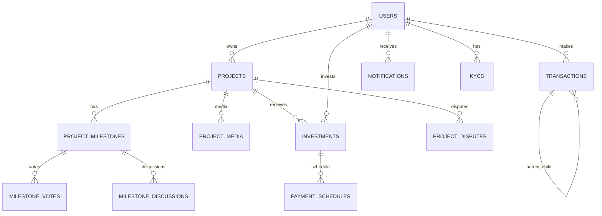

# DATABASE.md — Tổng quan thiết kế cơ sở dữ liệu

Mục đích: tài liệu tóm tắt schema chính cho nền tảng gọi vốn/đầu tư (InvestPro). Bao gồm sơ đồ ER, danh sách thực thể cốt lõi, lưu đồ dòng tiền và phần tham chiếu SQL DDL (dưới đây).

Last updated: 2026-05-10

Tóm tắt nhanh:

- Mô hình chính: Users (investor/owner/admin), Projects (cùng Milestones), Investments, Wallet/Transactions, KYC, Notifications, Disputes, Chat History.
- Tiền được giữ trong escrow theo giai đoạn (milestone). Transactions lưu parent-child để tách phí nền tảng và thanh toán tới investor/owner.

Thực thể cốt lõi (core entities):

- `users`: thông tin tài khoản, role, balance, trạng thái KYC, is_frozen.
- `projects`: metadata, mục tiêu gọi vốn, trạng thái, liên kết `owner_id`.
- `project_milestones`: milestone + evidence + trạng thái voting/admin review.
- `investments`: mối quan hệ investor ↔ project, số tiền và trạng thái.
- `transactions`: ledger cho mọi luồng tiền (deposit, invest, disbursement, refund, repayment, fee).
- `kycs`: ảnh CMND/CCCD và trạng thái xét duyệt.
- `notifications`: per-user notifications, read/unread.
- `project_disputes`: khiếu nại/đóng băng dự án.
- `chat_history`: lưu context AI per-user.

ER diagram (mermaid) — khái quát:

Ghi chú kiến trúc & vận hành:

- Escrow/milestone: tiền investor được ghi nhận trong ledger (`transactions`) và chỉ disburse theo milestone khi thỏa điều kiện (admin review hoặc capital-weighted vote).
- KYC & AccountStatusGuard: nhiều endpoint yêu cầu KYC `APPROVED` và `is_frozen = false`.
- Audit: mọi thay đổi tiền tệ cần tạo transaction record; giữ `parent_transaction_id` để truy vết split (ví dụ platform fee).
- Index cần thiết: users(email), users(slug), projects(slug), projects(owner_id), investments(user_id, project_id), transactions(user_id, created_at).

Phần tham chiếu SQL DDL (bắt đầu ngay sau đây) — trích xuất từ TypeORM entities.

CREATE TABLE users (
id BIGINT UNSIGNED AUTO_INCREMENT PRIMARY KEY,
email VARCHAR(150) NOT NULL UNIQUE,
password VARCHAR(255) NOT NULL,
full_name VARCHAR(100) NOT NULL,
role ENUM('investor', 'owner', 'admin') DEFAULT 'investor',
balance DECIMAL(15, 2) DEFAULT 0.00,
avatar_url VARCHAR(255) NULL,
is_verified TINYINT(1) DEFAULT 0,
bio TEXT NULL,
cover_photo_url VARCHAR(255) NULL,
social_links JSON NULL,
notification_settings JSON NULL,
is_frozen TINYINT(1) DEFAULT 0,
slug VARCHAR(150) UNIQUE NULL,
address VARCHAR(255) NULL,
created_at TIMESTAMP DEFAULT CURRENT_TIMESTAMP,
updated_at TIMESTAMP DEFAULT CURRENT_TIMESTAMP ON UPDATE CURRENT_TIMESTAMP
);

CREATE TABLE project_categories (
id BIGINT UNSIGNED AUTO_INCREMENT PRIMARY KEY,
name VARCHAR(100) NOT NULL,
slug VARCHAR(100) NOT NULL UNIQUE,
description TEXT NULL,
icon_url VARCHAR(255) NULL,
created_at TIMESTAMP DEFAULT CURRENT_TIMESTAMP
);

CREATE TABLE projects (
id BIGINT UNSIGNED AUTO_INCREMENT PRIMARY KEY,
owner_id BIGINT UNSIGNED NOT NULL,
category_id BIGINT UNSIGNED NOT NULL,
title VARCHAR(255) NOT NULL,
slug VARCHAR(255) NOT NULL UNIQUE,
address VARCHAR(255) NULL,
short_description TEXT NULL,
content LONGTEXT NULL,
goal_amount DECIMAL(15, 2) NOT NULL,
current_amount DECIMAL(15, 2) DEFAULT 0.00,
min_investment DECIMAL(15, 2) NOT NULL,
interest_rate DECIMAL(5, 2) NOT NULL,
commission_rate DECIMAL(5, 2) NULL,
duration_months INT NOT NULL,
risk_level ENUM('low', 'medium', 'high') DEFAULT 'medium',
status ENUM('pending', 'funding', 'active', 'pending_admin_review', 'completed', 'overdue', 'failed') DEFAULT 'pending',
start_date DATE NULL,
end_date DATE NULL,
is_frozen TINYINT(1) DEFAULT 0,
allow_overfunding TINYINT(1) DEFAULT 0,
total_debt DECIMAL(15, 2) DEFAULT 0.00,
owner_tier INT DEFAULT 1,
created_at TIMESTAMP DEFAULT CURRENT_TIMESTAMP,
FOREIGN KEY (owner_id) REFERENCES users(id) ON DELETE CASCADE,
FOREIGN KEY (category_id) REFERENCES project_categories(id)
);

CREATE TABLE project_media (
id INT UNSIGNED AUTO_INCREMENT PRIMARY KEY,
project_id BIGINT UNSIGNED NOT NULL,
url VARCHAR(255) NOT NULL,
type ENUM('image', 'video') DEFAULT 'image',
is_thumbnail TINYINT(1) DEFAULT 0,
sort_order INT DEFAULT 0,
FOREIGN KEY (project_id) REFERENCES projects(id) ON DELETE CASCADE
);

CREATE TABLE project_milestones (
id INT UNSIGNED AUTO_INCREMENT PRIMARY KEY,
project_id BIGINT UNSIGNED NOT NULL,
title VARCHAR(255) NOT NULL,
content TEXT NULL,
percentage INT NOT NULL,
stage INT NOT NULL,
status ENUM(
'pending',
'uploading_proof',
'voting',
'admin_review',
'disbursed',
'completed',
'rejected',
'disputed'
) DEFAULT 'pending',
evidence_urls TEXT NULL,
disbursement_date TIMESTAMP NULL,
voting_ends_at TIMESTAMP NULL,
rejection_reason TEXT NULL,
interval_days INT DEFAULT 0,
next_disbursement_date TIMESTAMP NULL,
created_at TIMESTAMP DEFAULT CURRENT_TIMESTAMP,
FOREIGN KEY (project_id) REFERENCES projects(id) ON DELETE CASCADE
);

CREATE TABLE milestone_discussions (
id INT UNSIGNED AUTO_INCREMENT PRIMARY KEY,
milestone_id INT UNSIGNED NOT NULL,
sender_id BIGINT UNSIGNED NOT NULL,
content TEXT NOT NULL,
created_at TIMESTAMP DEFAULT CURRENT_TIMESTAMP,
FOREIGN KEY (milestone_id) REFERENCES project_milestones(id) ON DELETE CASCADE,
FOREIGN KEY (sender_id) REFERENCES users(id) ON DELETE CASCADE
);

CREATE TABLE milestone_votes (
id INT UNSIGNED AUTO_INCREMENT PRIMARY KEY,
milestone_id INT UNSIGNED NOT NULL,
user_id BIGINT UNSIGNED NOT NULL,
is_approve TINYINT(1) NOT NULL,
comment TEXT NULL,
investor_capital DECIMAL(15, 2) DEFAULT 0.00,
created_at TIMESTAMP DEFAULT CURRENT_TIMESTAMP,
FOREIGN KEY (milestone_id) REFERENCES project_milestones(id) ON DELETE CASCADE,
FOREIGN KEY (user_id) REFERENCES users(id) ON DELETE CASCADE
);

CREATE TABLE investments (
id BIGINT UNSIGNED AUTO_INCREMENT PRIMARY KEY,
user_id BIGINT UNSIGNED NOT NULL,
project_id BIGINT UNSIGNED NOT NULL,
amount DECIMAL(15, 2) NOT NULL,
status ENUM('active', 'completed', 'withdrawn') DEFAULT 'active',
invested_at TIMESTAMP DEFAULT CURRENT_TIMESTAMP,
FOREIGN KEY (user_id) REFERENCES users(id) ON DELETE CASCADE,
FOREIGN KEY (project_id) REFERENCES projects(id) ON DELETE CASCADE
);

CREATE TABLE payment_schedules (
id INT UNSIGNED AUTO_INCREMENT PRIMARY KEY,
investment_id BIGINT UNSIGNED NOT NULL,
due_date DATE NOT NULL,
amount DECIMAL(15, 2) NOT NULL,
status ENUM('unpaid', 'paid', 'overdue') DEFAULT 'unpaid',
paid_at TIMESTAMP NULL,
FOREIGN KEY (investment_id) REFERENCES investments(id) ON DELETE CASCADE
);

CREATE TABLE transactions (
id BIGINT UNSIGNED AUTO_INCREMENT PRIMARY KEY,
user_id BIGINT UNSIGNED NOT NULL,
amount DECIMAL(15, 2) NOT NULL,
type ENUM('deposit', 'withdrawal', 'invest', 'interest_receive', 'refund', 'disbursement', 'repayment', 'repay_interest', 'repay_principal', 'system_fee', 'system_log') NOT NULL,
status ENUM('pending', 'success', 'failed') DEFAULT 'success',
description VARCHAR(255) NULL,
reference_id INT NULL,
parent_transaction_id BIGINT UNSIGNED NULL,
bank_name VARCHAR(100) NULL,
account_number VARCHAR(50) NULL,
created_at TIMESTAMP DEFAULT CURRENT_TIMESTAMP,
FOREIGN KEY (user_id) REFERENCES users(id) ON DELETE CASCADE,
FOREIGN KEY (parent_transaction_id) REFERENCES transactions(id) ON DELETE SET NULL
);

CREATE TABLE project_disputes (
id INT UNSIGNED AUTO_INCREMENT PRIMARY KEY,
project_id BIGINT UNSIGNED NOT NULL,
user_id BIGINT UNSIGNED NOT NULL,
reason TEXT NOT NULL,
evidence_url TEXT NULL,
status ENUM('open', 'resolved', 'refunded') DEFAULT 'open',
created_at TIMESTAMP DEFAULT CURRENT_TIMESTAMP,
FOREIGN KEY (project_id) REFERENCES projects(id) ON DELETE CASCADE,
FOREIGN KEY (user_id) REFERENCES users(id) ON DELETE CASCADE
);

CREATE TABLE user_favorite_categories (
user_id BIGINT UNSIGNED NOT NULL,
category_id BIGINT UNSIGNED NOT NULL,
PRIMARY KEY (user_id, category_id),
FOREIGN KEY (user_id) REFERENCES users(id) ON DELETE CASCADE,
FOREIGN KEY (category_id) REFERENCES project_categories(id) ON DELETE CASCADE
);

CREATE TABLE user_blacklist_categories (
user_id BIGINT UNSIGNED NOT NULL,
category_id BIGINT UNSIGNED NOT NULL,
PRIMARY KEY (user_id, category_id),
FOREIGN KEY (user_id) REFERENCES users(id) ON DELETE CASCADE,
FOREIGN KEY (category_id) REFERENCES project_categories(id) ON DELETE CASCADE
);

CREATE TABLE notifications (
id INT UNSIGNED AUTO_INCREMENT PRIMARY KEY,
user_id BIGINT UNSIGNED NOT NULL,
message TEXT NOT NULL,
type ENUM('PROJECT_UPDATE', 'INVESTMENT_RECEIVED', 'PAYMENT_SUCCESS', 'SYSTEM') DEFAULT 'SYSTEM',
is_read TINYINT(1) DEFAULT 0,
created_at TIMESTAMP DEFAULT CURRENT_TIMESTAMP,
FOREIGN KEY (user_id) REFERENCES users(id) ON DELETE CASCADE
);

CREATE TABLE chat_history (
id INT UNSIGNED AUTO_INCREMENT PRIMARY KEY,
user_id BIGINT UNSIGNED NOT NULL,
role ENUM('user', 'model', 'system') NOT NULL,
message TEXT NOT NULL,
project_context JSON NULL,
created_at TIMESTAMP DEFAULT CURRENT_TIMESTAMP,
INDEX idx_chat_history_user_created_at (user_id, created_at),
FOREIGN KEY (user_id) REFERENCES users(id) ON DELETE CASCADE
);

CREATE TABLE user_media (
id INT UNSIGNED AUTO_INCREMENT PRIMARY KEY,
user_id BIGINT UNSIGNED NOT NULL,
url VARCHAR(1024) NOT NULL,
public_id VARCHAR(255) NOT NULL,
file_name VARCHAR(255) NULL,
file_size INT NULL,
created_at TIMESTAMP DEFAULT CURRENT_TIMESTAMP,
FOREIGN KEY (user_id) REFERENCES users(id) ON DELETE CASCADE
);

CREATE TABLE kycs (
id BIGINT UNSIGNED AUTO_INCREMENT PRIMARY KEY,
user_id BIGINT UNSIGNED NOT NULL,
id_card_number VARCHAR(50) NOT NULL,
front_image_url VARCHAR(255) NOT NULL,
back_image_url VARCHAR(255) NOT NULL,
status ENUM('PENDING', 'APPROVED', 'REJECTED') DEFAULT 'PENDING',
rejection_reason TEXT NULL,
created_at TIMESTAMP DEFAULT CURRENT_TIMESTAMP,
updated_at TIMESTAMP DEFAULT CURRENT_TIMESTAMP ON UPDATE CURRENT_TIMESTAMP,
FOREIGN KEY (user_id) REFERENCES users(id) ON DELETE CASCADE
);

CREATE TABLE blogs (
id BIGINT UNSIGNED AUTO_INCREMENT PRIMARY KEY,
author_id BIGINT UNSIGNED NULL,
title VARCHAR(255) NOT NULL,
slug VARCHAR(255) NOT NULL UNIQUE,
summary TEXT NULL,
content LONGTEXT NULL,
status ENUM('draft','published','archived') DEFAULT 'published',
featured_image VARCHAR(255) NULL,
tags JSON NULL,
published_at TIMESTAMP NULL,
created_at TIMESTAMP DEFAULT CURRENT_TIMESTAMP,
updated_at TIMESTAMP DEFAULT CURRENT_TIMESTAMP ON UPDATE CURRENT_TIMESTAMP,
FOREIGN KEY (author_id) REFERENCES users(id) ON DELETE SET NULL
);

CREATE TABLE project_comments (
id BIGINT UNSIGNED AUTO_INCREMENT PRIMARY KEY,
project_id BIGINT UNSIGNED NOT NULL,
user_id BIGINT UNSIGNED NOT NULL,
content TEXT NOT NULL,
parent_comment_id BIGINT UNSIGNED NULL,
is_hidden TINYINT(1) DEFAULT 0,
created_at TIMESTAMP DEFAULT CURRENT_TIMESTAMP,
FOREIGN KEY (project_id) REFERENCES projects(id) ON DELETE CASCADE,
FOREIGN KEY (user_id) REFERENCES users(id) ON DELETE CASCADE,
FOREIGN KEY (parent_comment_id) REFERENCES project_comments(id) ON DELETE SET NULL
);

CREATE TABLE milestone_vote_snapshots (
id BIGINT UNSIGNED AUTO_INCREMENT PRIMARY KEY,
milestone_id BIGINT UNSIGNED NOT NULL,
snapshot_at TIMESTAMP DEFAULT CURRENT_TIMESTAMP,
total_raised DECIMAL(15,2) DEFAULT 0.00,
snapshot_json JSON NULL,
created_at TIMESTAMP DEFAULT CURRENT_TIMESTAMP,
FOREIGN KEY (milestone_id) REFERENCES project_milestones(id) ON DELETE CASCADE
);
