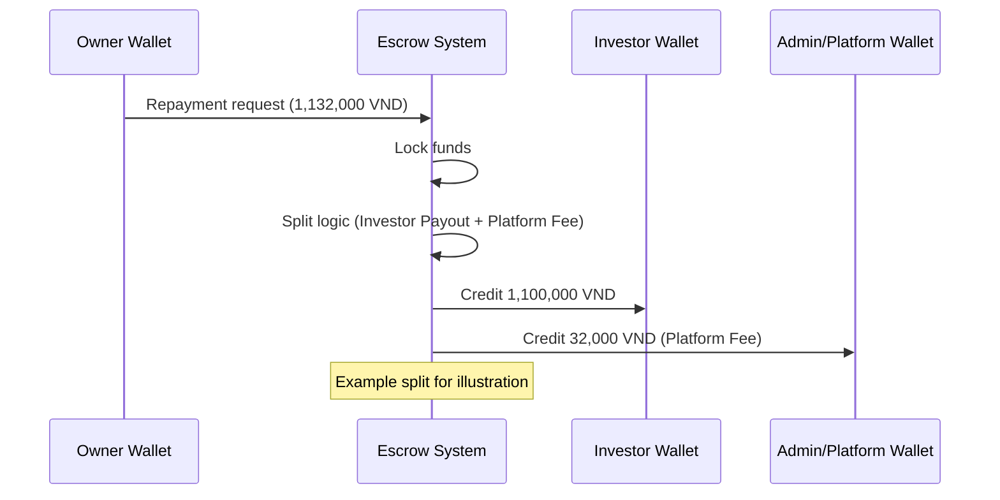
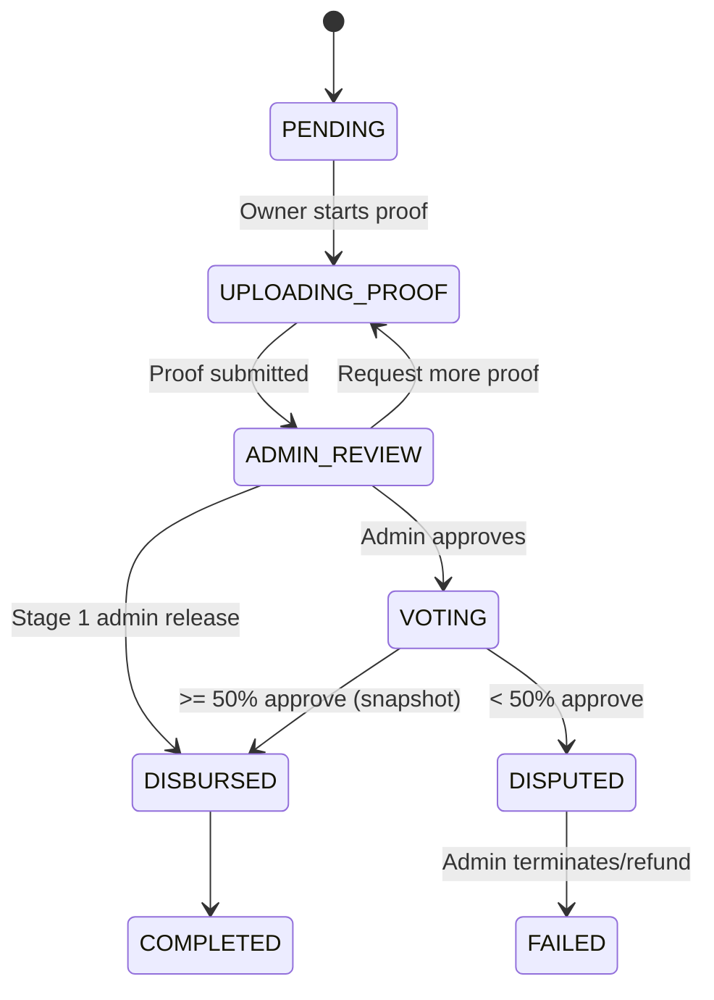
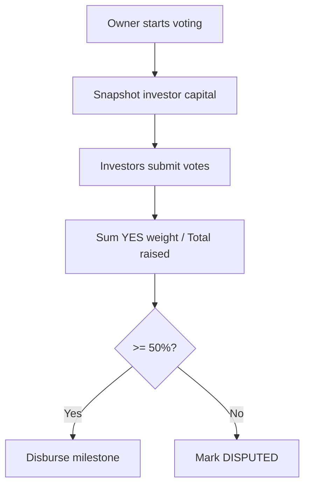

# InvestPro (AI-vest) 🚀

<p align="center">
  <em>Nền tảng Gọi vốn Cộng đồng (Crowdfunding) & Đầu tư Vi mô hiện đại, tích hợp AI và Quản trị Rủi ro thông minh.</em>
</p>

---

## 🌟 Giới thiệu

**InvestPro** là giải pháp Fintech tiên phong, kết nối trực tiếp nhà đầu tư cá nhân với các dự án tiềm năng. Không chỉ là một nền tảng gọi vốn đơn thuần, InvestPro tái định nghĩa sự an toàn trong đầu tư cộng đồng thông qua cơ chế **Giải ngân theo Giai đoạn (Milestones)**, hệ thống **Tranh chấp Dân chủ (Dispute Management)** và trợ lý **Trí tuệ nhân tạo (AI Assistant)**.

---

## 🔥 Các Tính Năng Cốt Lõi

### 1. 🛡️ Bảo vệ Vốn bằng Milestone (Escrow-like)

Tiền của nhà đầu tư không được giải ngân 100% ngay từ đầu. Thay vào đó, quỹ được chia nhỏ thành các giai đoạn (ví dụ: 20% mỗi phần). Chủ dự án phải cung cấp bằng chứng hoàn thành (Proof of Work) để được Admin phê duyệt giải ngân giai đoạn tiếp theo.

### 2. ⚖️ Khiếu nại & Đóng băng Dòng tiền

Công bằng và minh bạch:

- Nếu >50% nhà đầu tư biểu quyết khiếu nại, dự án sẽ bị **Đóng băng (Frozen)** ngay lập tức.
- Admin có quyền thu hồi vốn còn lại để hoàn trả cho người dùng nếu phát hiện lừa đảo.

### 3. 🤖 Trợ lý Đầu tư AI (AI-vest Assistant)

Tích hợp trí tuệ nhân tạo để:

- Phân tích rủi ro và tiềm năng của từng dự án.
- Giải đáp thắc mắc của nhà đầu tư 24/7 dựa trên dữ liệu thực tế của dự án.
- Gợi ý danh mục đầu tư cá nhân hóa.

### 4. 📊 Phân tích Danh mục & Analytics

Hệ thống đồ thị động mạnh mẽ (Recharts) giúp nhà đầu tư:

- Theo dõi biến động số dư và lợi nhuận theo thời gian.
- Phân tích cơ cấu danh mục đầu tư theo lĩnh vực.

### 5. 🔔 Thông báo Thời gian thực (WebSockets)

Hệ thống đẩy thông báo tức thì (Socket.io) giúp người dùng không bỏ lỡ bất kỳ biến động nào: dự án đạt mốc gọi vốn, yêu cầu giải ngân mới, hoặc trạng thái giao dịch nạp/rút tiền.

### 6. 💳 Đa dạng Cổng Thanh toán

Hỗ trợ nạp tiền siêu tốc qua các cổng thanh toán hàng đầu Việt Nam: **VNPay** và **MoMo**, mang lại trải nghiệm đầu tư không rào cản.

---

## 🛠️ Công Nghệ & Kiến Trúc

### **Frontend**

- **Framework**: `Next.js 14` (App Router)
- **Styling**: `TailwindCSS` & `Lucide React`
- **Charts**: `Recharts`
- **Architecture**: Route Groups (`(admin)`, `(main)`) giúp phân tách module quyền hạn rõ ràng.

### **Backend**

- **Framework**: `NestJS` (Modular Architecture)
- **Database**: `MySQL` & `TypeORM`
- **Cloud Storage**: `Cloudinary` (Quản lý hình ảnh/bằng chứng dự án)
- **Real-time**: `Socket.io`
- **Security**: `JWT Passport`, RBAC (Role-Based Access Control)

---

## 📂 Tài liệu Dự án

Để hiểu sâu hơn về kiến trúc và cách thức tích hợp, vui lòng tham khảo:

- 📑 [**API Documentation**](API.MD): Danh sách chi tiết các Endpoint.
- 🏗️ [**File Structure**](FILE_STRUCTURE.md): Sơ đồ tổ chức mã nguồn.
- 🗄️ [**Database Schema**](DATABASE.md): Thiết kế CSDL và quan hệ thực thể.
- 🛠️ [**Development Guide**](DEVELOPMENT.md): Hướng dẫn thiết lập môi trường.

---

## 📘 Technical Documentation

### Escrow & Milestone Funding Model (Overview)

- Investor funds are held in escrow during FUNDING.
- When funding closes, platform fee is collected once and the net pool is released by milestone.
- Stage 1 is released by Admin after funding closes.
- Subsequent stages require proof upload, admin review, and capital-weighted voting before disbursement.
- Disputes can freeze the project and trigger refunds of undisbursed funds.

### Money Flow & Repayment Formula

Total debt is calculated using principal and interest only:

$$Total\ Debt = P + (P \times r \times (d/12))$$

Where:

- $P$ = Principal invested
- $r$ = Annual interest rate (percent)
- $d$ = Duration in months

Repayment split:

- Investor Payout = principal + interest in the repayment batch
- Platform Fee = fee rate \* interest (credited to Admin/Platform wallet)
- Owner Charge = Investor Payout + Platform Fee

Milestone disbursement (single upfront fee):

- Platform Fee = Total Raised \* Commission Rate (credited once to Admin wallet)
- Net Pool = Total Raised - Platform Fee
- Milestone Payout = Net Pool \* (Milestone%/100)

All monetary splits are rounded to 2 decimal places.

### Transaction Types (11)

- DEPOSIT: Wallet top-up request
- WITHDRAWAL: Wallet withdrawal request
- INVEST: Investment into a project
- INTEREST_RECEIVE: Investor receives interest
- REFUND: Refund for failed/terminated project
- DISBURSEMENT: Escrow releases funds to project owner
- REPAYMENT: Owner repays project debt
- REPAY_INTEREST: Owner pays interest portion
- REPAY_PRINCIPAL: Owner pays principal portion
- SYSTEM_FEE: Platform fee collected
- SYSTEM_LOG: System-only ledger entry

### Mermaid Diagrams







## 💻 Hướng Dẫn Cài Đặt

### 1. Cấu hình Môi trường

Tạo file `.env` trong thư mục `server/` dựa trên `.env.example`.

### 2. Khởi động Backend

```bash
cd server
npm install
npm run start:dev
```

### 3. Khởi động Frontend

```bash
cd client
npm install
npm run dev
```

---

> _InvestPro hướng tới một cộng đồng đầu tư minh bạch, an toàn và thông minh hơn._

11/04/2026: google auth, momo payment,rich text for project, trang profile
